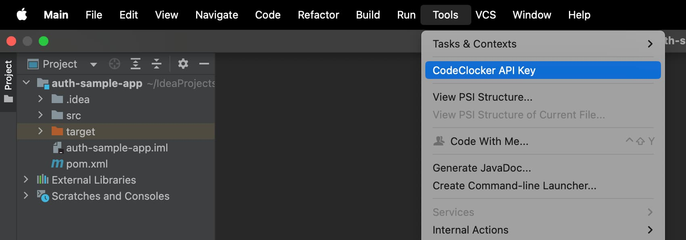

# CodeClocker – IntelliJ Plugin for Tracking Developer Activity

<!-- Plugin description -->

## CodeClocker Time Tracker

CodeClocker automatically tracks your coding time and activity, displaying it in the IDE status bar and on the [CodeClocker Hub](https://hub.codeclocker.com/).

[

### Features

* **Coding Time Tracking** – Automatically records time spent on each project.
* **VCS Added & Removed Lines** – Tracks the number of added and removed lines in VCS.
* **IDE Status Bar Widget** – Displays current coding activity directly in IDE status bar for quick at-a-glance monitoring.
* **Personal Activity Web Dashboard** – Visualises coding activity on web dashboard on [CodeClocker Hub](https://hub.codeclocker.com/).
* **Team Dashboard** – Create and manage teams on [CodeClocker Hub](https://hub.codeclocker.com/) to monitor collective coding activity:
  * **Team Statistics** – View aggregated metrics including total time and daily average.
  * **Contributors Overview** – See individual contributor stats with hours coded.
  * **Project Activity Charts** – Visualize team activity per project with stacked bar charts showing each contributor's participation.
  * **Time Period Filtering** – Analyze team performance over different time ranges (e.g., Last 7 Days).

<!-- Plugin description end -->

## Installation

- Using the IDE built-in plugin system:
  
  <kbd>Settings/Preferences</kbd> > <kbd>Plugins</kbd> > <kbd>Marketplace</kbd> > <kbd>Search for "CodeClocker"</kbd> >
  <kbd>Install</kbd>
  
- Using JetBrains Marketplace:

  Go to [JetBrains Marketplace](https://plugins.jetbrains.com/plugin/26962) and install it by clicking the <kbd>Install to ...</kbd> button in case your IDE is running.

  You can also download the [latest release](https://plugins.jetbrains.com/plugin/26962/versions) from JetBrains Marketplace and install it manually using
  <kbd>Settings/Preferences</kbd> > <kbd>Plugins</kbd> > <kbd>⚙️</kbd> > <kbd>Install plugin from disk...</kbd>

- Manually:

  Download the [latest release](https://github.com/codeclocker/codeclocker-intellij-plugin/releases/latest) and install it manually using
  <kbd>Settings/Preferences</kbd> > <kbd>Plugins</kbd> > <kbd>⚙️</kbd> > <kbd>Install plugin from disk...</kbd>

## API Key Activation

1. After [installation](#installation), a dialog will prompt you to enter your CodeClocker API key. 
  Click "Get API Key" to be redirected to the [API Key page on CodeClocker Hub](https://hub.codeclocker.com/api-key). 
  Copy your API key from this page.
2. Return to your running IntelliJ IDE, paste the copied API key into the dialog window, and click "OK".

Once set up, CodeClocker will automatically track your coding activity and report it to [CodeClocker Hub](https://hub.codeclocker.com). 
If your API key status initially shows "Inactive: No received data yet," don’t worry—it may take up to a minute for activity tracking to start. 
Once active, it will update to "Active: Receiving data".

If you need to open the API Key dialog window in your IntelliJ IDE (for example, you accidentally closed it during initial plugin installation), then go to **Tools > CodeClocker API Key** at the top of the dropdown list.

